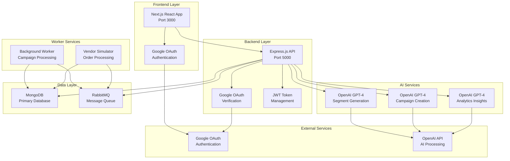

# Xeno CRM

A modern, AI-powered Customer Relationship Management system built with Next.js, Express.js, and MongoDB. Features intelligent customer segmentation, automated campaign management, and real-time analytics with Google OAuth authentication.

## Project Summary

Xeno CRM is a full-stack CRM solution that leverages AI to automatically generate customer segments from natural language descriptions, create targeted marketing campaigns, and provide intelligent analytics insights. The system includes a responsive web interface, RESTful API backend, background worker services, and vendor simulation capabilities for testing and development.

## Local Setup Instructions

### Prerequisites
- Node.js >= 18.17.0
- npm >= 9.0.0
- MongoDB (local or cloud instance)
- Google Cloud Console account (for OAuth)

### 1. Clone the Repository
```bash
git clone https://github.com/Vi1en/XENO-CRM.git
cd XENO-CRM
```

### 2. Install Dependencies
```bash
# Install root dependencies
npm install

# Install all workspace dependencies
npm run build
```

### 3. Environment Setup

Create environment files for each service:

#### Backend (.env)
```bash
# Database
MONGODB_URI=mongodb://localhost:27017/xeno-crm

# Google OAuth
GOOGLE_CLIENT_ID=your_google_client_id
GOOGLE_CLIENT_SECRET=your_google_client_secret

# JWT
JWT_SECRET=your_jwt_secret_key

# OpenAI
OPENAI_API_KEY=your_openai_api_key

# Server
PORT=5000
NODE_ENV=development

# CORS
FRONTEND_URL=http://localhost:3000
```

#### Frontend (.env.local)
```bash
NEXT_PUBLIC_API_URL=http://localhost:5000/api/v1
NEXT_PUBLIC_GOOGLE_CLIENT_ID=your_google_client_id
```

#### Worker (.env)
```bash
MONGODB_URI=mongodb://localhost:27017/xeno-crm
RABBITMQ_URL=amqp://localhost:5672
```

### 4. Database Setup
```bash
# Start MongoDB (if using local instance)
mongod

# Or use MongoDB Atlas cloud instance
# Update MONGODB_URI in .env files
```

### 5. Google OAuth Setup
1. Go to [Google Cloud Console](https://console.cloud.google.com/)
2. Create a new project or select existing
3. Enable Google+ API
4. Create OAuth 2.0 credentials
5. Add authorized redirect URIs:
   - `http://localhost:5000/api/v1/google/callback`
   - `http://localhost:3000/auth/callback`

### 6. Run the Application

#### Development Mode (All Services)
```bash
npm run dev
```

#### Individual Services
```bash
# Frontend only
npm run dev:frontend

# Backend only
npm run dev:backend

# Worker only
npm run dev:worker

# Vendor Simulator only
npm run dev:vendor
```

### 7. Access the Application
- **Frontend**: http://localhost:3000
- **Backend API**: http://localhost:5000
- **API Documentation**: http://localhost:5000/api-docs

## Architecture Diagram



## Tech Stack

### Frontend
- **Framework**: Next.js 13.5.6
- **UI Library**: React 18
- **Styling**: Tailwind CSS 3.4.0
- **Forms**: React Hook Form 7.62.0
- **Validation**: Zod 3.22.4
- **HTTP Client**: Axios 1.12.2
- **TypeScript**: 5.x

### Backend
- **Runtime**: Node.js 18.17.0+
- **Framework**: Express.js 4.18.2
- **Database**: MongoDB with Mongoose 8.0.3
- **Authentication**: Google OAuth 2.0 + JWT
- **Message Queue**: RabbitMQ (AMQP)
- **API Documentation**: Swagger/OpenAPI
- **Security**: Helmet, CORS
- **TypeScript**: 5.3.3

### AI & Machine Learning
- **Primary AI**: OpenAI GPT-4
- **Services**:
  - Natural Language to Segment Rules
  - Campaign Message Generation
  - Analytics Insights Generation
  - Customer Behavior Analysis

### Infrastructure & Deployment
- **Frontend Hosting**: Netlify
- **Backend Hosting**: Railway
- **Database**: MongoDB Atlas
- **Containerization**: Docker
- **CI/CD**: Git-based deployment

### Development Tools
- **Package Manager**: npm workspaces
- **Process Manager**: Concurrently
- **Linting**: ESLint + TypeScript ESLint
- **Code Formatting**: Prettier
- **Type Checking**: TypeScript

## Known Limitations / Assumptions

### Technical Limitations
- **AI Dependency**: Requires OpenAI API key and credits for AI features
- **Google OAuth**: Requires Google Cloud Console setup for authentication
- **MongoDB**: Requires MongoDB instance (local or cloud)
- **Single Tenant**: Currently designed for single organization use
- **Rate Limiting**: No built-in rate limiting for API endpoints

### Functional Assumptions
- **Customer Data**: Assumes customer data is provided via API or manual entry
- **Campaign Delivery**: Campaign delivery is simulated (no actual email/SMS sending)
- **Real-time Updates**: Some features may require page refresh for latest data
- **Mobile Responsiveness**: Optimized for desktop and tablet, mobile support is basic

### Security Considerations
- **JWT Tokens**: Stored in localStorage (consider httpOnly cookies for production)
- **API Keys**: Environment variables must be properly secured
- **CORS**: Currently configured for development URLs
- **Input Validation**: Basic validation in place, may need enhancement

### Performance Assumptions
- **Database**: Assumes MongoDB can handle expected data volume
- **AI Processing**: OpenAI API response times may vary
- **Concurrent Users**: Not tested with high concurrent user loads
- **File Uploads**: No file upload functionality implemented

### Development Notes
- **Environment**: Tested primarily in development environment
- **Browser Support**: Modern browsers (Chrome, Firefox, Safari, Edge)
- **Node.js**: Requires Node.js 18.17.0 or higher
- **Dependencies**: Some dependencies may have security vulnerabilities (run `npm audit`)

---

## Contributing

1. Fork the repository
2. Create a feature branch
3. Make your changes
4. Test thoroughly
5. Submit a pull request

## License

This project is private and proprietary. All rights reserved.